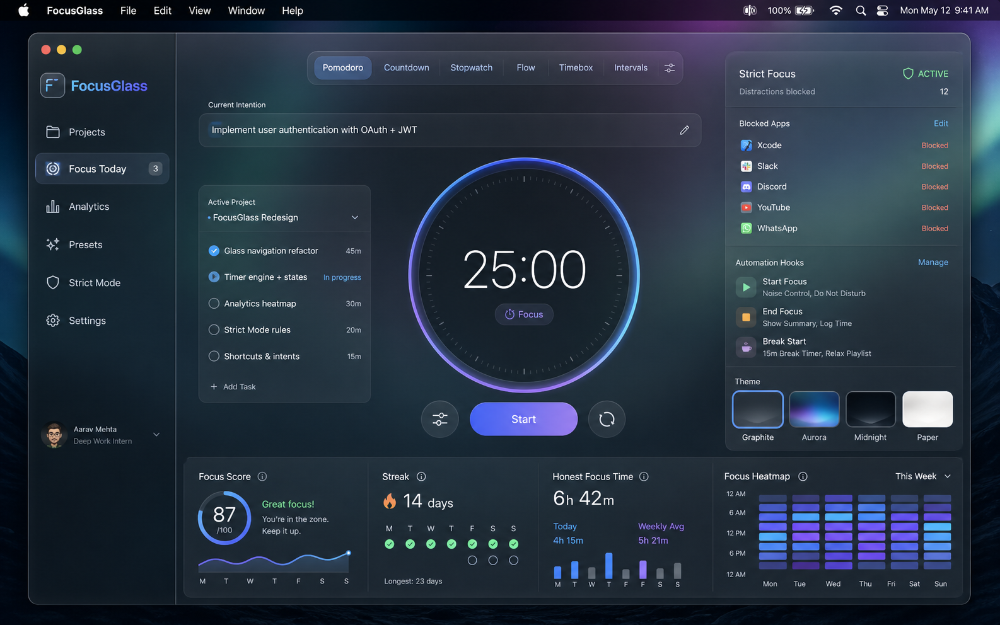
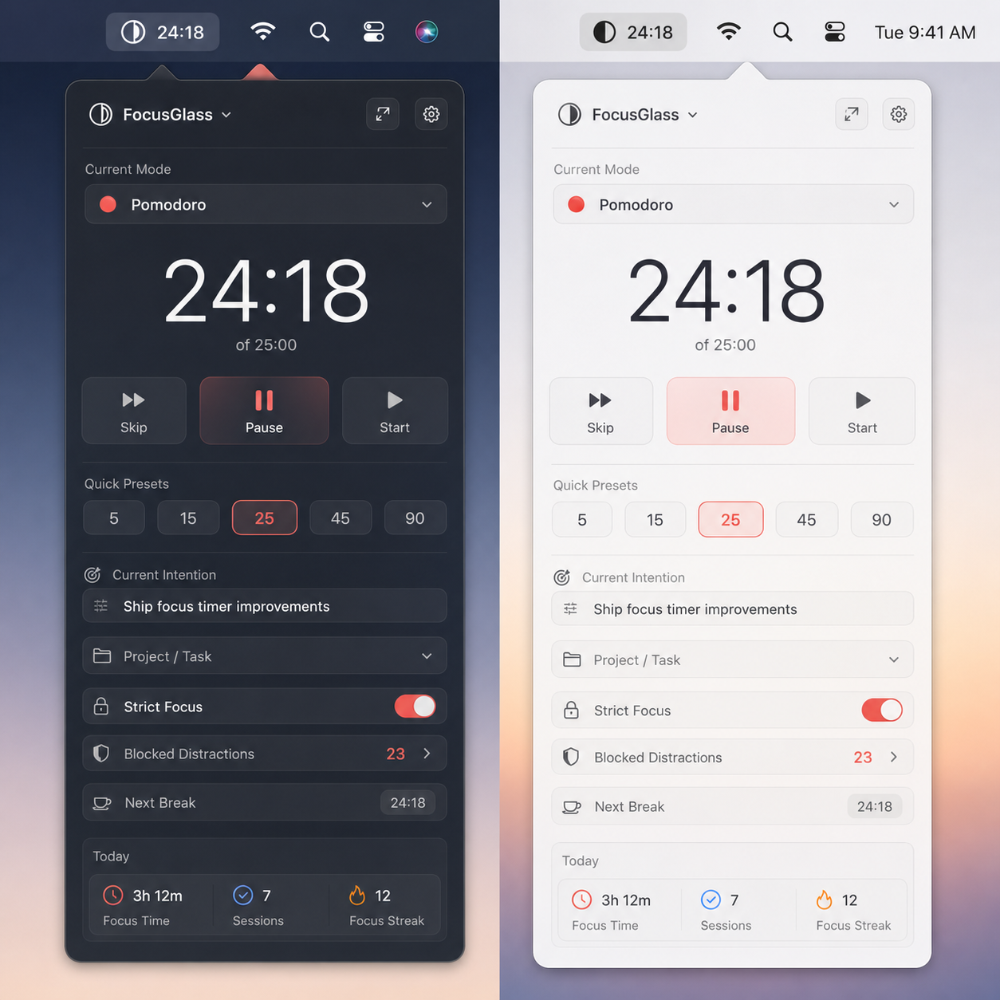
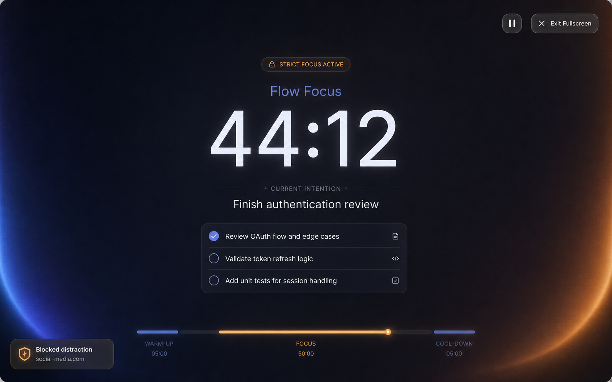

# FocusGlass

> Нативный macOS focus cockpit для людей, которые хотят не просто включить таймер, а спокойно пройти весь цикл работы: подготовиться, сфокусироваться, защитить сессию и увидеть честный результат.

FocusGlass создаётся как локальное приложение с уважением к пользователю: без аккаунтов, облака и лишней суеты. Оно должно открываться сразу в рабочий экран, помогать выбрать режим, проект и задачу, а затем удерживать внимание через полноэкранный фокус, menu bar HUD и мягкий strict mode.



## Что уже есть

- Нативное SwiftUI-приложение для macOS.
- Главное окно-cockpit для текущей фокус-сессии.
- Menu bar панель для быстрого контроля.
- Полноэкранный focus mode.
- Редактируемые проекты, задачи и таймерные пресеты.
- Strict mode для приложений и сайтов через macOS Accessibility/Automation.
- Локальное JSON-хранилище без аккаунтов и синхронизации.
- RU/EN локализация.
- Theme Studio с адаптацией под light/dark.
- Тестируемое ядро таймера и аналитики.

## Зачем это приложение

Обычный таймер отвечает только на вопрос “сколько осталось?”. FocusGlass должен отвечать на более полезные вопросы:

- над чем я сейчас работаю;
- сколько времени я планировал потратить;
- сколько честного фокуса получилось;
- что меня отвлекало;
- стоит ли продолжить задачу, завершить её или сменить режим.

Главная идея проекта: сделать фокус-сессию видимой и управляемой, но не превращать приложение в тяжёлый task-manager.

## Основной цикл

1. Выбрать режим: Pomodoro, Countdown, Stopwatch, Flow, Timebox или Intervals.
2. Указать намерение на сессию.
3. Выбрать проект и задачу.
4. Запустить таймер.
5. При необходимости перейти в fullscreen focus.
6. Дать strict mode вернуть внимание при отвлечении.
7. После сессии посмотреть честный результат.

## Скриншоты дизайна

| Главное окно | Menu bar | Fullscreen focus |
| --- | --- | --- |
|  |  |  |

## Технологии

- Swift 6
- SwiftUI
- AppKit integrations
- Swift Package Manager
- Testing framework
- Local JSON persistence
- UserNotifications
- Accessibility
- Apple Events / Automation
- ServiceManagement для Launch at Login

## Требования

- macOS 14 или новее.
- Xcode рекомендуется для полноценной сборки и отладки.
- Для проверки Notifications, Accessibility и Automation нужно запускать именно `.app`, а не только `swift run`.

## Сборка и тесты

```sh
swift build --disable-sandbox
swift test --disable-sandbox --scratch-path /tmp/FocusGlassApp_MacOS-swift-test
```

Основной dev-loop для ручного тестирования реальной macOS `.app`:

```sh
FOCUSGLASS_DATA_DIR=/private/tmp/focusglass-qa-data ./script/build_and_run.sh --verify
```

Скрипт использует `./Scripts/package-app.sh` как источник логики упаковки,
перезапускает `build/FocusGlass.app` и поддерживает `--logs`, `--telemetry` и
`--debug`. `swift run FocusGlass` допустим только для узкой отладки: macOS не
считает такой процесс полноценным приложением, поэтому permissions, Menu Bar,
fullscreen и packaged-app UI проверяются через `.app`.

Сборка zip-артефакта для ручной передачи тестеру:

```sh
./Scripts/package-release.sh
```

Номер версии хранится в `VERSION`, например `0.0.4`. Для публично отмеченной
сборки commit дополнительно помечается tag вида `v0.0.4`; если текущий commit
стоит ровно на таком tag, скрипты берут версию из tag. Скрипт создаёт
`FocusGlass.app`, `FocusGlass-<version>.zip` и `.sha256` под
`build/releases/<version>/`. Папка `build/` остаётся локальным generated output
и не коммитится. Если нужен удобный способ передать сборку тестеру, можно
вручную создать Draft/Pre-release в GitHub и прикрепить уже собранные zip и
`.sha256`.

## Структура проекта

```text
Sources/
  FocusGlassCore/      # чистое ядро таймера, аналитики и strict-rule типов
  FocusGlassApp/       # SwiftUI/AppKit приложение, сервисы, ViewModel, ресурсы
Tests/                 # тесты ядра и app persistence
docs/                  # архитектура, продукт, дизайн и QA
docs/process/          # правила GitHub, релизов и разработки
Scripts/               # упаковка .app и генерация иконки
archive/               # безопасный архив вынесенных неиспользуемых файлов
VERSION                # текущий понятный номер сборки для тестера и релиза
```

## Документация

- [Product Context](docs/product-context.md) - зачем существует FocusGlass и что сейчас в зоне продукта.
- [Architecture](docs/architecture.md) - устройство приложения, persistence, permissions, strict mode, темы.
- [Assistant Context](docs/assistant-context.md) - первый файл для будущих AI-сессий.
- [Design Source](docs/design/design-source.md) - локальный источник визуальной системы.
- [QA Checklist](docs/qa-checklist.md) - ручная и автоматическая проверка.
- [GitHub Workflow](docs/process/github-workflow.md) - ветки, коммиты, теги, релизы и правила работы.
- [Roadmap](docs/process/roadmap.md) - ближайшее развитие без смены идеи проекта.
- [Tester Checklist](docs/process/tester-checklist.md) - снимок полного ручного прохода для tester-сборки `0.0.4`.
- [Tester Rules](docs/process/tester-rules.md) - правила, словарь терминов и критерии blocker для тестера.
- [Tester Report Template](docs/process/tester-report-template.md) - снимок шаблона отчёта для `0.0.4` со screenshots и severity.

Документация считается частью реализации. Если меняется поведение, структура данных, permissions, UI, сборка или QA, соответствующий документ обновляется в том же изменении.

## Как ведётся разработка

Проект ведётся по аккуратному GitHub-процессу:

- `main` - стабильная ветка.
- `codex/next` - основная ветка работы ассистента.
- `feature/next` - рабочая ветка владельца, когда она нужна.
- `codex/<topic>` / `feature/<topic>` - изолированные изменения.
- `fix/...` - исправления.
- `chore/...` - инфраструктура и уборка.
- `docs/...` - документация.
- коммиты пишутся на русском в формате `тип: краткое действие`;
- релизы отмечаются тегами `vMAJOR.MINOR.PATCH`;
- изменения для пользователей фиксируются в [CHANGELOG.md](CHANGELOG.md).

Подробные правила: [docs/process/github-workflow.md](docs/process/github-workflow.md).

## Текущий статус

Проект находится в активной разработке. В текущей ветке уже реализованы
post-session outcome, project notes, persistent strict distraction history,
planned-vs-actual analytics, явные Light/Dark варианты тем, общий знак
AppIcon/launch animation, lifecycle-managed Menu Bar panel и полный проход зон
нажатия. Первый interface-performance pass изолировал секундный timer state,
закэшировал task/analytics summaries и исправил адаптивные project cards.
Следующий performance-pass унифицировал все scroll surfaces, убрал hover/shadow
churn во время движения и сократил одновременно открытый Theme Studio editor.
Product Design pass на реальных накопленных данных улучшил плотность Analytics
и Strict History. Следующий implementation-pass добавил task-level analytics:
сводки по `taskID`, актуальный контекст существующих задач, исторический
fallback удалённых задач и отдельную политику timed/checklist.
Нулевой motion/performance pass добавил единую `FocusGlassMotion` policy,
value-scoped transitions, Reduce Motion fallback, throttled Theme Studio
sliders, облегчённый glass во время прокрутки и Instruments signposts. Live
packaged-app и Instruments proof хранится в
`/private/tmp/focusglass-motion-performance-20260811-154559`.
Tester-сборка `0.0.4` остаётся отдельным историческим снимком и не включает
изменения из секции `Unreleased`.

Ближайший порядок: провести отдельный полный VoiceOver/accessibility audit,
затем подготовить Developer ID signing и notarized канал распространения.
Custom timer presets и strict-rule presets отложены до подтверждённой
потребности из tester feedback. Детальный порядок хранится в
[roadmap](docs/process/roadmap.md) и [handoff](handoff.md).

## Принципы проекта

- Локальность важнее облачной сложности.
- Фокус важнее количества функций.
- UI должен быть красивым, но рабочим.
- Пользовательские данные нельзя терять молча.
- Permissions должны объясняться честно.
- Каждый видимый элемент должен иметь реальное поведение.

## Лицензия

Лицензия ещё не выбрана. До выбора лицензии код считается закрытым для переиспользования вне личного разрешения автора.
